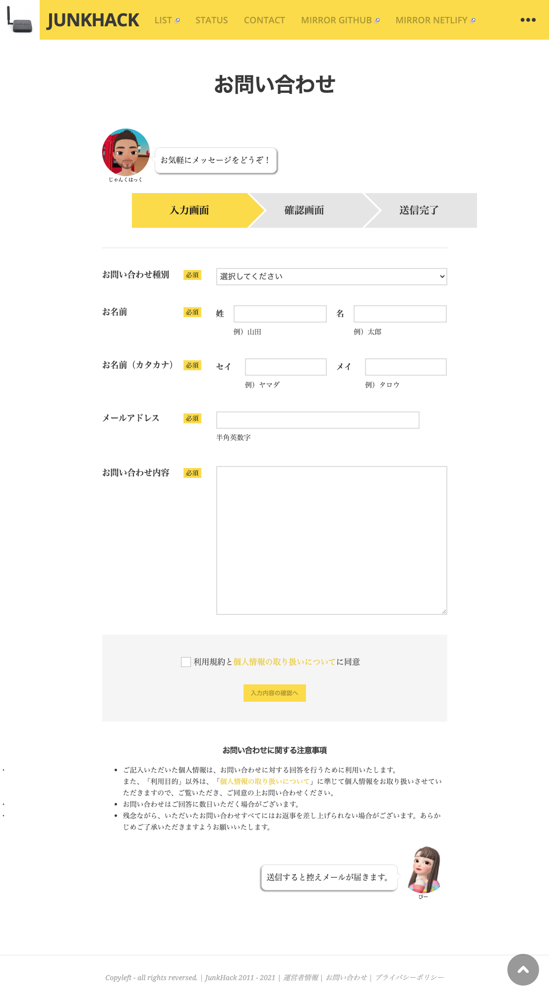
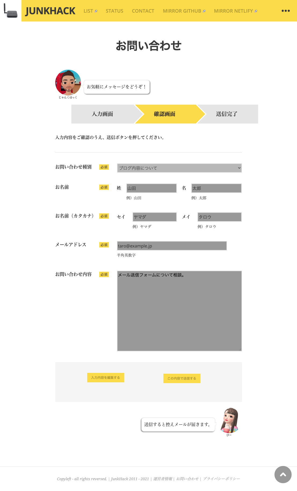
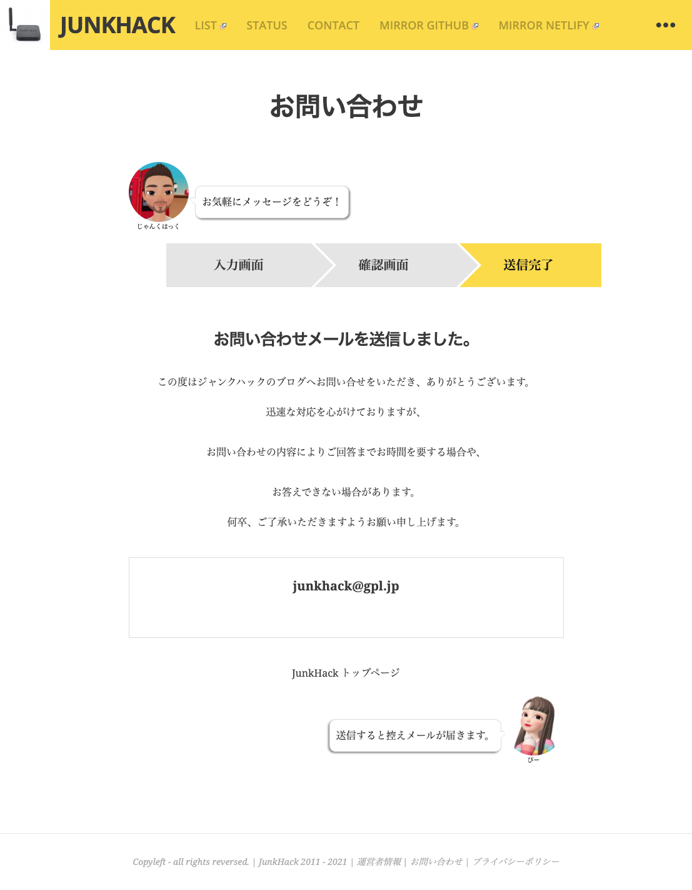

# contact-form-7-add-confirm ver 5.1.1
Contact form 7 と組み合わせて利用するプラグインです。確認画面を作り戻って編集する機能があります。しかし、古いプラグインなのでver 5.1だと以下の不具合があります。

1. Contact form 7 add confirmの確認ボタンを押しても動かない
2. 送信完了メッセージが表示されない
3. [acceptance]による非チェック時にConfirmボタンがdisabledにならない
4. reCAPTCHA（リキャプチャ）と同時に利用できない

動作確認は、Contact form 7 ver 5.4.1 [[Download Link]](https://downloads.wordpress.org/plugin/contact-form-7.5.4.1.zip)と組み合わせてWordPress5.7.2で行いました。reCAPTCHAは、v3を使っています。（v2は未確認）

# example
以下のように動作します。
> https://junkhack.gpl.jp/sendmail/

### Step1

### Step2

### Step3

# 修正方法
この修正方法は、以下サイトで紹介されていたものを行ったのみです。
[[オランダで生きていく]](https://nldot.info/how-to-fix-the-contact-form-7-add-confirm-response-to-the-latest-cf7/)

このブログで紹介されている、修正概略は以下です。
1. イベントリスナー名を`event.detail.id`から`event.detail.unitTag`に変更
2. 送信完了画面時に、`wpcf7c-force-hide`をセットし非表示にする
3. 承諾確認チェックボックス`[acceptance]`の利用時、非チェック状態だとConfirmボタンがdisabledにならない不具合は、判別処理を追記

なお、3 の機能についてはexampleサイトでは別実装にしていますので、これが動作するかは未確認です。

# ブログに遊びにきてね
JunkHackというブログをやっていますので、是非遊びにきてください。
> [アリエクでポチった JUNKHACK](https://junkhack.gpl.jp/)
